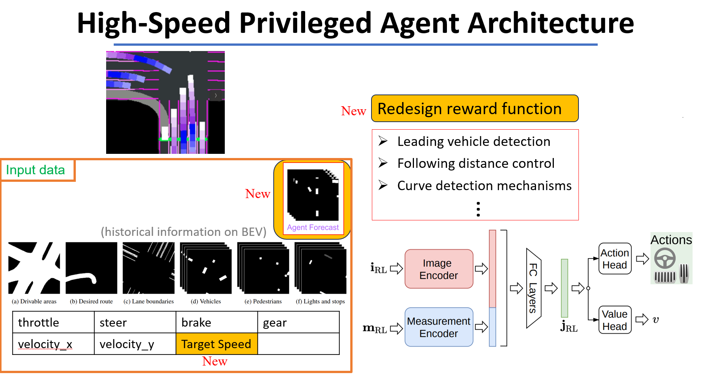

# End-to-end reinforcement learning for ADAS high-speed privileged agent



<!-- > [**End-to-end reinforcement learning for ADAS high-speed privileged agent**](https://etheses.lib.ntust.edu.tw/)    
>  Guan-Yan, LIN,  Yie-Tarng Chen   -->

## Introduction

The high-speed privileged agent is an improved end-to-end reinforcement learning privileged agent based on [Roach](https://github.com/zhejz/carla-roach). We redesigned the reward function and the model's input, enabling high-speed driving while reducing collisions, and improving unreasonable driving behaviors to enhance comfort and safety.


## Setup
Download and setup CARLA 0.9.10.1
```
mkdir carla
cd carla
wget https://carla-releases.s3.eu-west-3.amazonaws.com/Linux/CARLA_0.9.10.1.tar.gz
tar -xvzf CARLA_0.9.11.tar.gz
cd Import && wget https://carla-releases.s3.eu-west-3.amazonaws.com/Linux/AdditionalMaps_0.9.10.1.tar.gz
cd .. && bash ImportAssets.sh
rm CARLA_0.9.10.1.tar.gz
rm AdditionalMaps_0.9.10.1.tar.gz
cd && source .bashrc
```

Clone this repo and build the environment

```
git clone https://github.com/eson88866/hspa.git
cd hspa
conda env create -f environment.yml --name hspa
conda activate hspa
```
For 4090 (If the pytorch and cuda versions of the environment and your GPU do not match, you need to go to the following website to change the version. [Previous PyTorch Versions](https://pytorch.org/get-started/previous-versions/))
```
pip install torch==1.13.0+cu117 torchvision==0.14.0+cu117 torchaudio==0.13.0 --extra-index-url https://download.pytorch.org/whl/cu117
```

- We use [wandb](https://wandb.ai/site) for logging, please register a free account and login to it.
```
wandb login
```

## Training
To achieve stability in high-speed driving, we initially 'train only in Town 6' and 'remove pedestrians'. However, during testing, we achieve good results both in all six towns and specifically in Town 6. (Ablation studies include results from training across six towns.)
In `config/train_envs/endless_nowalker.yaml`, you can modify the towns and the number of vehicles for training.

To train a high-speed privileged agent, modify the `CARLA_ROOT` in ``run/train_rl.sh`` and execute
```
run/train_rl.sh
```
(CARLA will automatically start without the need to open another terminal.)

## Evaluation
We provide a checkpoint located at `leaderboard/team_code/hspa/log/ckpt_10174464.pth`.
In `setup` of `team_code/hspa_10174464.py`, the specified checkpoint will be used.
In `tick` of `team_code/hspa_10174464.py`, you can specify the target speed (default is dynamic adjustment according to road speed limits).

First, launch the carla server

```
cd CARLA_ROOT
./CarlaUE4.sh --world-port=2000 -opengl
```
Set the carla path, routes file, scenario file, model ckpt, and data path for evaluation in `leaderboard/scripts/run_evaluation.sh`.

Start the evaluation

```
sh leaderboard/scripts/run_evaluation.sh
```
In the output JSON file, some new metrics have been added, but they do not participate in the existing total score calculation method of the CARLA leaderboard.

## Data Generation
The command is the same as for Evaluation, but in `leaderboard/scripts/run_evaluation.sh`, specify the `SAVE_PATH`.

## Code Structure
We give the structure of our code. Note that we only introduce those folders/files are commonly used and modified.

    hspa/
    ├── agents/rl_bridview
    |   ├── models                # Ppo policy & Models
    |   ├── utils                 # RL wrapper & wandb
    |   └── rl_bridview_agent.py  # RL agent
    ├── carla_gym                 # Creating an OpenAI Gym environment
    |   ├── core
    |   |   ├── obs_manager       # Observation & birdview
    |   |   ├── task_actor        # Criteria & Navigation &...
    |   |   |   └── ego_vehicle   # Reward function & Termination condition
    |   ├── envs                  # Some settings of the environment
    |   ├── utils                 # Some settings of the environment
    |   |   └── hazard_actor.py   # a few obstacle detector
    |   └── carla_multi_agent_env.py  # Based on the reinforcement learning environment of the CARLA simulator
    ├── config            # Configuration
    |   ├── agent
    |   |   ├── ppo       # Observation & policy & Training hyperparameters
    |   |   └── ppo.yaml  # agent & birdview & input configuration
    |   └── train_envs    # Training town configuration
    ├── figures
    ├── leaderboard       # Code for offline carla leaderboard
    │   ├── data          # Save routes and scenarios
    │   ├── scripts       # Evaluation scripts
    │   ├── team_code
    |   |   ├── hspa              # Checkpoints & Evaluation configuration
    │   |   └── hspa_10174464.py  # Interface for closed-loop evaluation of our model
    │   ├── leaderboard           # From Carla official
    |   |   ├── utils/statistics_manager.py  # Statistics of various testing indicators
    |   |   └── leaderboard_evaluator.py # Entrance of closed-loop evaluation
    ├── run               # A script for training hspa
    ├── scenario_runner   # From Carla official
    │   ├── srunner
    │   |   └── scenariomanager/scenarioatomics/atomic_criteria.py  # We define a new test indicator
    ├── utils            #Automatically start carla server
    └── train.py         # Entrance of Training

## Citation

If you find our repo or our paper useful, please use the following citation:

<!-- ## License -->

## Acknowledgements

Our code is based on several repositories:
- [Roach](https://github.com/zhejz/carla-roach)
- [CARLA Leaderboard](https://github.com/carla-simulator/leaderboard)
- [Scenario Runner](https://github.com/carla-simulator/scenario_runner)
- [Transfuser](https://github.com/autonomousvision/transfuser)
